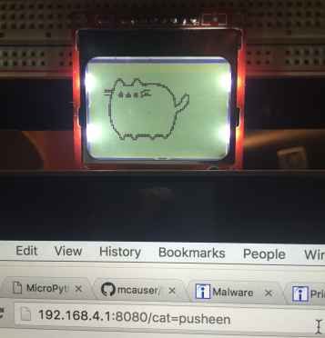
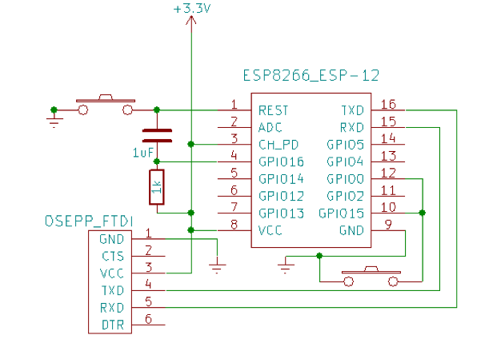
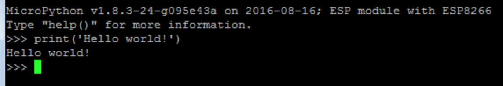
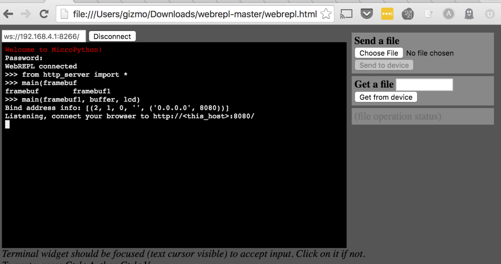

### The Internet of Cats - a micropython project
I wanted to learn a bit of [micropython](http://micropython.org) and a friend had an [ESP8266 micro controller](https://www.sparkfun.com/products/13678) and a [Nokia 5110 LCD display](https://www.sparkfun.com/products/10168) I could play with. And everyone loves cats, so thus the Internet of Cats was born!

This project was presented at [pydx](http://www.pydx.org) Oct 2016. You can follow along with [the presentation](https://docs.google.com/presentation/d/1AMXmYmvmftAEw1kQI4VNkugeQvjoKlBWJfrvhCs6y2g/edit?usp=sharing) or [watch the video](http://pyvideo.org/pydx-2016/micropython-for-mews.html)

#### What the heck is an internet of cats?
The Internet of cats is an access point for 1-bit cat pictures. A (very very simple) HTTP server runs on the ESP8266, listening for requests of 'cat=somecat'  If 'somecat' is found on the device, its bitmap will be rendered on the display, like so:



#### What! Thats amazing. How to I make one?
 I'm glad you asked! Feel free to follow along with my simple [step-by-step](http://www.homestarrunner.com/sbemail58.html) instructions. If you have any questions or problems please file an issue and I'll take a look.

But first! Thanks to the following folks for sharing their code and how-tos. This project would not have been possible without them.

<li>[Instructions for connecting the ESP-01 to the Nokia 5110 from Kendrick Tabi](https://www.kendricktabi.com/2015/08/esp8266-and-nokia-5110-lcd.html)
<li>[upcd8544.py by Markus Birth via Mike Causer](https://github.com/mcauser/MicroPython-ESP8266-Nokia-5110-Conways-Game-of-Life]upcd8544.py)
<li>[convert_png.py by Gary Bake](https://github.com/garybake/upython_wemos_shields/blob/master/oled/convert_png.py)
<li>http_server.py is based on [this example](https://github.com/micropython/micropython/tree/master/examples/network) from the MicroPython repo

#### Step 1, get the hardware

I prototyped this project using the [ESP-12](http://www.gearbest.com/transmitters-receivers-module/pp_227650.html) and later built a portable version with the [ESP-01](https://www.sparkfun.com/products/13678). The code folder in the repo has separate sub folders depending on which version of the ESP8266 you use. If I were to do it over again, I would probably use a breakout board like [this one from Adafruit](https://www.adafruit.com/product/2821). It would have saved me some debug and soldering time when adding an external supply and powering the chip. Adafruit also has some fantastic ESP8266 tutorials.

I used the [350mAh](https://www.adafruit.com/products/2750) and [500mAh](https://www.adafruit.com/products/1578) LiPo batteries from AdaFruit and they worked like a charm.

For the display, the version of the Nokia 5110 I had was [this one from Sparkfun](https://www.sparkfun.com/products/10168)

For connecting to the board, you will need a USB to TTY cable if you are just using the bare board like I did. <b>Important!</b> The supply for the ESP8266 is nominal 3.3V. Most off the shelf USB to TTY cables are 5V, which will reduce your project to a heap of smoldering sadness.

You will want something like this [USB to TTL board](http://www.dx.com/p/ft232bl-module-usb-to-ttl-board-module-support-5v-3-3v-421177#.WCC5UhIrK1s) that has a 3V supply based on how you set the jumper.

#### Step 2, setup the board to flash the MicroPython firmware

You need to put the ESP8266 into boot loader mode to flash the MicroPython firmware. Heres how to do it.

For the ESP-12, the following setup is required to flash the device. Namely, you need to ground GPIO0 and GPIO5. Make sure CH_PD is high.  
  
This photo is from [agcross.com](http://www.agcross.com/2015/09/the-esp8266-wifi-chip-part-3-flashing-custom-firmware)  

For the ESP-01, you can [follow this pinout from Sparkfun](https://cdn.sparkfun.com/datasheets/Wireless/WiFi/ESP8266ModuleV1.pdf) for basic pin descriptions. I printed it out so I could reference it while working.  To setup the ESP-01 configure the pins as described in [this table](https://github.com/esp8266/esp8266-wiki/wiki/Uploading), specifically CH_PD and GPIO2 should be high, and GPIO0 should be low. There is no GPIO15 on the ESP-01, so ignore that.

#### Step 3, flash the firmware
Now that you've setup your device in bootmode, get the latest micropython firmware and send it to the device.

To do this you will need
<li>The [latest micropython firmware for the ESP8266](http://micropython.org/download#esp8266)
<li>The [esptool](github.com/themadinventor/esptool/) for sending the firmware to the device:
>$ pip install esptool

At this point you need to connect the ESP8266 to the USB port if you haven't already to communicate over the RX/TX lines

First, erase the flash
>$ esptool.py --port /dev/ttyUSB0 erase_flash

Unplug and replug in the 8266. If you dont you might see the following if you proceed immediately to flashing the board:

> “A fatal error occurred: Failed to connect to ESP8266”

Next, load the flash. Depending on your USB port configuration and what other peripherals you have plugged in, the ESP8266 may not be on /dev/ttyUSB0 as indicated in the esptool command line below. To check, unplug the 8266 and run
>$ ls /dev/ttyUSB*

If this returns 'No such file or directory' then great, your ESP8266 is the only thing you are plugging in, so it should be easy to figure out what port it is on.

Plug in the 8266 and run the 'ls' command again, noting the difference between the USB ports mounted now. The ttyUSB* entry that is mounted after plugging in the 8266 is the one you need to use below.

Replace 'latest-firmware.bin' with the name of the firmware you downloaded.  

>$ esptool.py --port /dev/ttyUSB0 --baud 460800 write_flash --flash_size=8m 0 latest-firmware.bin

If this completed without complaining, congrats! You've flashed the firmware. Unplug / replug in the ESP8266 and open a terminal to test the install

####Step 4, connect to the REPL on the board
Open up a terminal and type the following, changing the USB port to the correct one for your setup:

>$ screen /dev/ttyUSB0 115200

You should see something like the following:



If not, you may need to try flashing again. Signs that I've had to reflash include errors about FAT 32 file system corruption, or fatal errors resulting in a scrolling sea of code spew.

Assuming you saw the picture above, you can now write Python to execute on the ESP8266!  Try typing some simple Python commands in the window. You should see the blue light on the ESP blinking as you type and execute commands.

####Step 5, starting WEBREPL and configuring the ESP8266 Access Point
MicroPython has this nifty web interface for programming your micro controller:


Mike Causer does a great job of stepping through setting up the access point and configuring WEBREPL, which you can [read here](https://github.com/mcauser/MicroPython-ESP8266-Nokia-5110-Conways-Game-of-Life#configure-access-point).

Once WEBREPL is configured, create a boot.py file containing the following:
```
import gc  
gc.collect()  
import webrepl  
webrepl.start()  
gc.collect()
```

When the ESP8266 starts up it will read the boot.py file, which will now import and start WEBREPL automatically. Restart the ESP8266 and try it out.

#### At this point, the instructions diverge based on which version of the ESP8266 you have.
The ESP-12 has more GPIO pins, so we can proceed piecemeal, testing the code we are uploading as we go along. Because the ESP-01 has fewer GPIOs, we will have to re-purpose some of the pins to use to drive the display, meaning we have to upload all the code required at once and then re-configure the board connections to drive the display. Don't worry if this doesn't make sense in prose, it will (hopefully!) as we walk through how to approach each.

### ESP-12

####Connecting the display
To connect the ESP-12 to the Nokia 5110 [follow this pin connection table from Mike Causer](https://github.com/mcauser/MicroPython-ESP8266-Nokia-5110-Conways-Game-of-Life#setup-and-test-nokia-5110-display).  We will test out the display after copying over the LCD files

####Copying the LCD files to the ESP8266
For this step, you will want to clone this repo locally
>$ git clone https://github.com/gizm00/pydx_upython.git  
>$ cd pydx_upython/code/esp12

We will copy over upcd8544.py, the driver for the Nokia 5110, and setup_lcd.py, the code for interacting with files. Using the 'Send a File' box in the WEBREPL window, choose and send these two files to the device. You will see '[filename] sent, nnnn bytes' in the status window when the file has been transferred.  

The lcd_setup.py file encapsulates the lcd startup and configuration steps, providing variables 'lcd' and 'framebuf1' that can be used to manipulate the LCD. After transferring both files try loading the LCD in WEBREPL and turning on the backlight:

>$ from setup_lcd import *  
>$ lcd.light_off()

Turn it off:  

>$ lcd.light_on()  

Fill the display:

>$ framebuf1.fill(1)  
>$ lcd.data(framebuf1)


### ESP-01
Coming soon, need to get a drawing of the wiring diagram for connecting the ESP-01 to the 5110.


####Copying the LCD files to the ESP8266
For this step, you will want to clone this repo locally
>$ git clone https://github.com/gizm00/pydx_upython.git  
>$ cd pydx_upython/code/esp01


####Step 6, image translation
We cant just send an image file to the 5110, first we need to convert it to a 1-bit bitmap. You can use the [pre-converted bitmaps](https://github.com/gizm00/pydx_upython/tree/master/cat_text_files) or, to make your own, follow the instructions on slides 19-22 from [the presentation](https://docs.google.com/presentation/d/1AMXmYmvmftAEw1kQI4VNkugeQvjoKlBWJfrvhCs6y2g/edit?usp=sharing)

####Step 7, drawing the cats
Now the exciting part! Drawing the cats. First lets move the cat text files and the drawing code over to the ESP8266

Using WEBREPL, copy over the cat text images you'd like to use to the ESP8266 from the [cat_text_files directory](https://github.com/gizm00/pydx_upython/tree/master/cat_text_files).
Next, copy over  draw_image_from_file.py from the [code folder](https://github.com/gizm00/pydx_upython/tree/master/code) to the ESP8266

If you'd like, you can use the chdir.py code on the ESP8266 to create a 'cats' directory and move the cat text files into there. http_server.py assumes the cat pics are in this folder, but you can easily change it to just look in the root dir. More on that in a bit.

Now update the boot.py file to import draw_image_from_file:

```
import gc
gc.collect()

from setup_lcd import *
from draw_image_from_file import *
gc.collect()
import webrepl
webrepl.start()
gc.collect()  
```
Now, reboot the ESP8266.  Lets try to draw some cat pics!  The LCD and image drawing routines should already be initialized, so you should be able to do the following in WEBREPL:

>$ draw_image('smoosheen.txt', framebuf1, buffer, lcd)  

or, if you put the images in a cats directory:

>$ draw_image('cats/smoosheen.txt', framebuf1, buffer, lcd)

framebuf1, buffer, and lcd should have been created when setup_lcd was loaded by boot.py.  You should now see a smooshed pusheen on your LCD:  

  


####Step 8, setting up the Internet
Now that we've got cat images printing to the LCD, lets setup a very basic HTTP server to allow the cat pics to be requested.

Lets start by taking a look at http_server.py in the [code folder](https://github.com/gizm00/pydx_upython/tree/master/code). Basically, it waits for requests and then checks for a 'cat=' argument.  You can modify this file to add additional cat requests, setting lcd_cat to the corresponding cat text file name:

```
if req.find('GET /cat=sitting') > 0:
    lcd_cat = 'sitting_cat.txt'
if req.find('GET /cat=smoosheen') > 0:
    lcd_cat = 'smoosheen.txt'
```  

After request has been read, we check to see if lcd_cat has been populated, and if so, send the appropriate file name to the LCD for printing:

```
if len(lcd_cat) > 0:
    lcd_cat = 'cats/' + lcd_cat
    print("sending cat to LCD")
    print("lcd cat: " + str(lcd_cat))
    draw_image(lcd_cat, framebuf1, buffer1, lcd)
```  

If you aren't using a 'cats' directory, modify the second line above to correctly point to the location of your cat text files on the ESP8266

Once you've made any necessary modifications to http_server.py, use WEBREPL again to copy it over to the ESP8266.

Update the boot.py one more time to start the http server on startup. Conversely, you can choose to leave the boot.py as is and manually import and run 'main' from the http_server code via WEBREPL

new boot.py to automatically start the http server:
```
import gc
gc.collect()

from setup_lcd import *
from draw_image_from_file import *
gc.collect()


from http_server import *
gc.collect()
import webrepl
webrepl.start()
gc.collect()
main(framebuf1, buffer1, lcd)
```

You can either update your boot.py or use the final one from the [esp01 folder](https://github.com/gizm00/pydx_upython/blob/master/code/esp01/boot.py). The difference between the ESP-12 and ESP-01 is in the setup_lcd and upcd8544 code, the boot.py files are interchangeable.  

A warning about memory; sometimes I found that the memory required by the modules exceeded the heap available on the ESP8266. When that happens I would sometimes see the following error when rebooting the ESP8266:

```
Traceback (most recent call last):
  File "<stdin>", line 1, in <module>
  File "http_server.py", line 27, in main
```

If you see this try removing the http server import from boot.py and restarting the ESP8266. There are methods for minimizing code size that are outside the scope of this project that you might investigate to deal with memory issues like this.

Now, when you restart the ESP8266, remembering to log in to the access point created by the ESP8266, you should be able to send a cat request:

> http://192.168.4.1:8080/cat=smoosheen

Which should result in the pusheen pic as above being displayed on the LCD.
